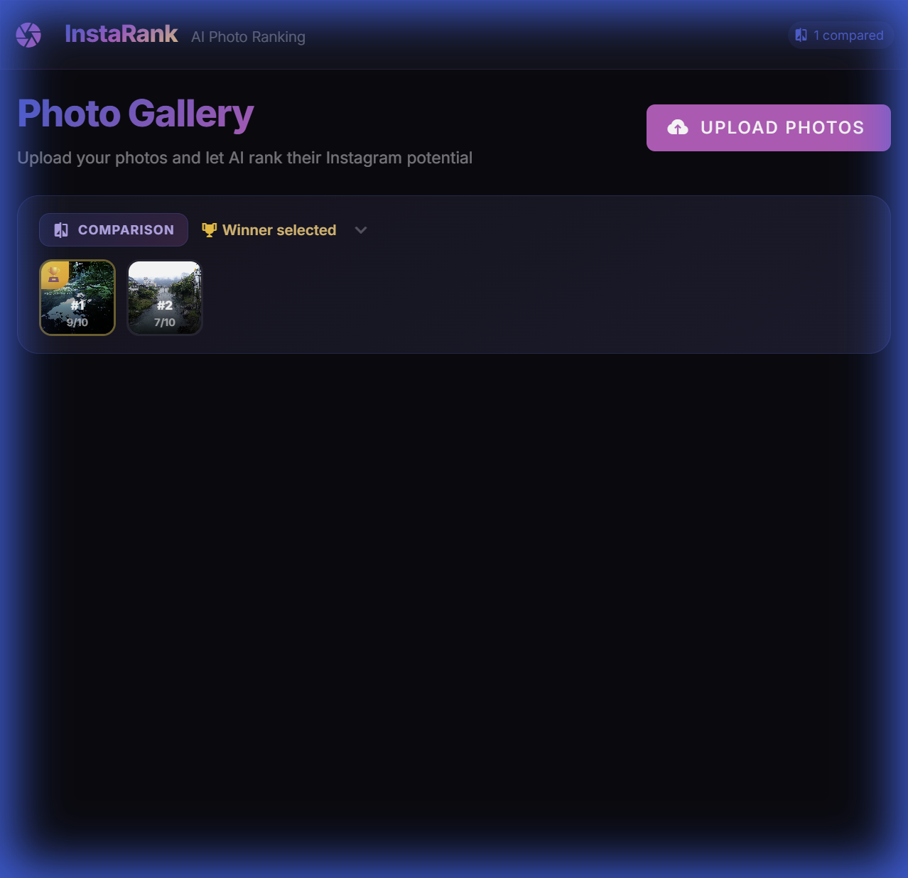
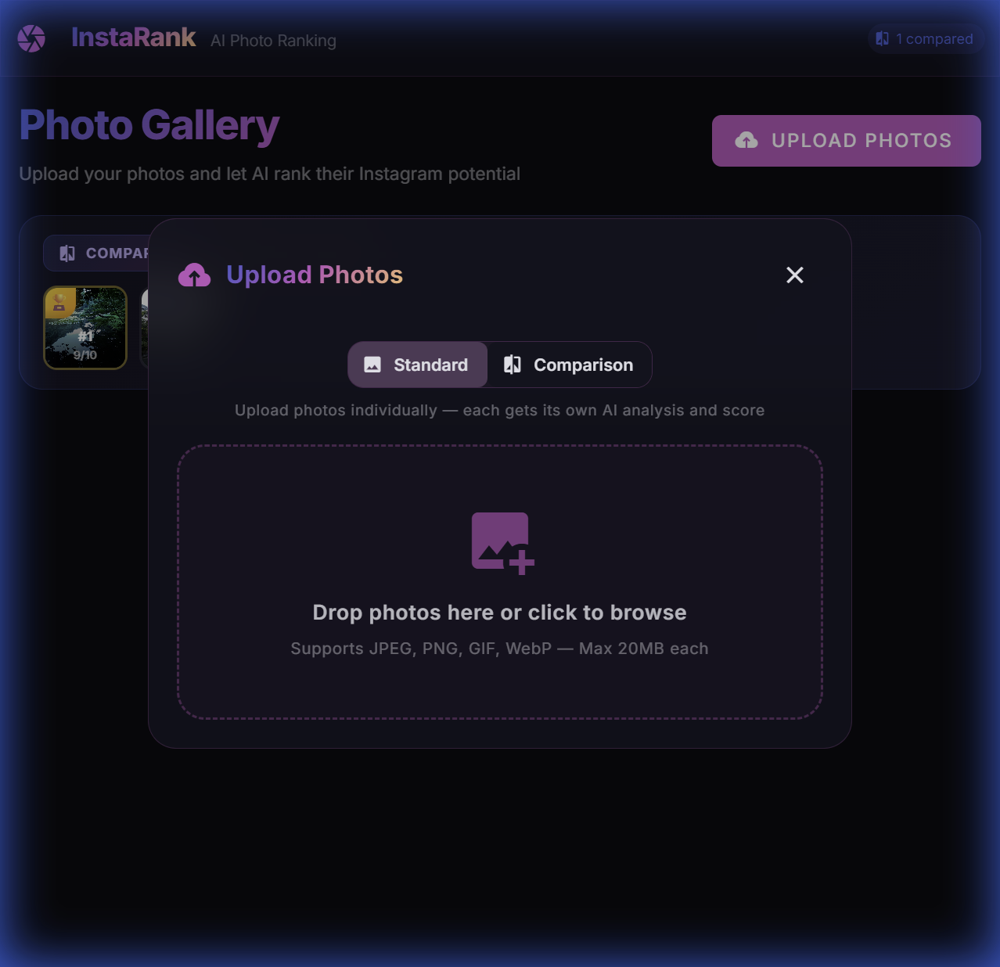
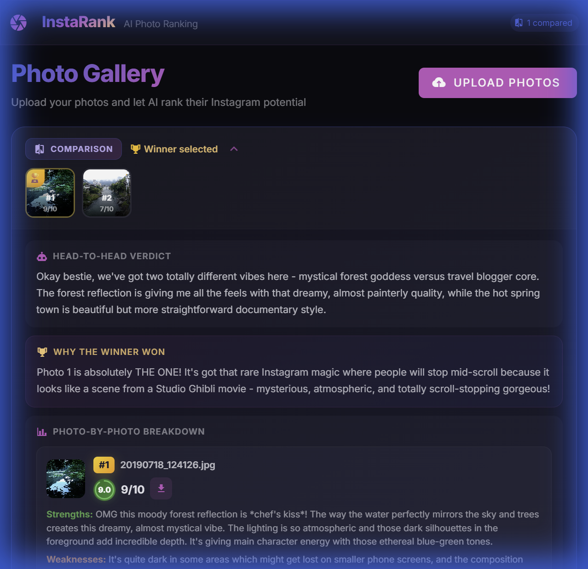

# 📸 InstaRank — AI Photo Ranking

**InstaRank** is a full-stack web application that uses AI to rank your photos for Instagram potential. Upload a photo and get an instant, detailed analysis scored across six dimensions — or pit multiple photos head-to-head and let the AI pick your best shot.

Powered by **Claude** (Anthropic's vision model), InstaRank delivers honest, conversational feedback written like a friend who happens to be obsessed with photography.

---

## ✨ Features

- **🎯 AI Photo Analysis** — Upload any photo and receive a detailed score (1–10) across six dimensions: Composition, Lighting, Color & Mood, Subject & Focus, Visual Impact, and Instagram Fit.
- **⚔️ Head-to-Head Comparison** — Upload 2–4 photos and let the AI compare them side-by-side, ranking each with strengths, weaknesses, and a winner declaration.
- **💬 Conversational Feedback** — No dry ratings — the AI speaks like your photography-obsessed best friend, with casual language, specific observations, and genuine enthusiasm.
- **💡 Pro Tips** — Every analysis includes a tailored, actionable tip to improve the shot.
- **🏆 Score Breakdown** — Animated, color-coded score bars for each dimension with per-dimension feedback.
- **🖼️ Image Lightbox** — Click any thumbnail to view the full-size image with download options.
- **📱 Responsive Design** — Premium dark-mode UI with glassmorphic panels and Instagram-inspired gradients, fully responsive on mobile.
- **🔄 Re-rank** — Not satisfied with a score? Re-run the AI analysis on any photo with one click.

---

## 📷 Screenshots

### Gallery Overview
The main gallery page showing a comparison result with ranked thumbnails. The winner gets a gold 🏆 badge and border.



### Upload Dialog
Upload photos in **Standard** mode (individual analysis) or **Comparison** mode (head-to-head ranking). Drag and drop or click to browse.



### AI Comparison Analysis
Expand any comparison card to reveal the full AI breakdown — a Head-to-Head Verdict, Why the Winner Won, and a per-photo strengths/weaknesses analysis.



---

## 🛠️ Tech Stack

| Layer      | Technology                                                |
| ---------- | --------------------------------------------------------- |
| **Frontend** | Vue 3, Vuetify 3, Vue Router, Vite, TypeScript, Sass     |
| **Backend**  | Node.js, Express, TypeScript, Multer, Sharp               |
| **AI**       | Claude (Anthropic API) — vision model for image analysis  |
| **Dev**      | Concurrently (mono-repo dev runner), tsx (TS runner)      |

---

## 🚀 Getting Started

### Prerequisites

- **Node.js** v18+ and npm
- An **Anthropic API key** ([get one here](https://console.anthropic.com/))

### Installation

1. **Clone the repository**
   ```bash
   git clone https://github.com/alexjp7/insta-rank.git
   cd insta-rank
   ```

2. **Install all dependencies** (root, server, and client)
   ```bash
   npm run install:all
   ```

3. **Configure the API key**

   Create or edit `server/.env`:
   ```env
   claude_key=YOUR_ANTHROPIC_API_KEY
   CLAUDE_MODEL=claude-sonnet-4-20250514
   PORT=3001
   ```

4. **Start the development servers**
   ```bash
   npm run dev
   ```

   This launches both the backend (port 3001) and frontend (port 5173) simultaneously.

5. **Open the app**: Navigate to `http://localhost:5173` in your browser.

---

## 📖 Usage

### Standard Mode — Rank a Single Photo

1. Click **Upload Photos** on the gallery page.
2. Select **Standard** mode (default).
3. Drag and drop your photo(s) or click to browse.
4. Click **Upload & Rank** — the AI will analyze each photo individually.
5. View your score, expand the row for a full breakdown with per-dimension scores and a Pro Tip.

### Comparison Mode — Head-to-Head Ranking

1. Click **Upload Photos** and switch to **Comparison** mode.
2. Select 2–4 photos to compare.
3. Click **Upload & Compare** — the AI evaluates all photos side-by-side.
4. The gallery shows a comparison card with ranked thumbnails (🏆 for the winner).
5. Expand the card to read the full Head-to-Head Verdict, Why the Winner Won, and per-photo strengths/weaknesses.

### Other Actions

- **🔍 Preview** — Click any thumbnail to view the full-size image in a lightbox.
- **⬇️ Download** — Download the original photo from the preview or inline buttons.
- **🔄 Re-rank** — Hit the refresh icon on any photo to re-run the AI analysis.
- **🗑️ Delete** — Remove photos individually.

---

## 🔌 API Reference

All endpoints are prefixed with `/api/photos`.

| Method   | Endpoint                   | Description                           |
| -------- | -------------------------- | ------------------------------------- |
| `GET`    | `/`                        | List all photos, sorted by score      |
| `GET`    | `/:id`                     | Get a single photo by ID              |
| `GET`    | `/:id/download`            | Download the original photo file      |
| `POST`   | `/upload`                  | Upload one or more photos             |
| `POST`   | `/:id/rank`                | Trigger AI ranking for a photo        |
| `POST`   | `/compare`                 | Upload 2–4 photos for comparison      |
| `GET`    | `/comparisons/list`        | List all comparison groups            |
| `GET`    | `/comparisons/:id`         | Get a single comparison result        |
| `DELETE` | `/:id`                     | Delete a photo                        |

---

## 📂 Project Structure

```
insta-rank/
├── package.json              # Root mono-repo scripts (dev, install:all)
├── client/                   # Vue 3 frontend
│   ├── src/
│   │   ├── App.vue           # App shell with nav bar and status chips
│   │   ├── router.ts         # Vue Router — Gallery + Photo Detail routes
│   │   ├── components/
│   │   │   ├── PhotoUpload.vue   # Upload dialog (Standard / Comparison)
│   │   │   └── ScoreBadge.vue    # Animated circular score indicator
│   │   ├── composables/
│   │   │   └── usePhotos.ts      # Shared state and API calls
│   │   ├── views/
│   │   │   ├── GalleryView.vue       # Main gallery — timeline, rankings, lightbox
│   │   │   └── PhotoDetailView.vue   # Individual photo detail page
│   │   ├── styles/
│   │   │   └── main.css          # Global styles, gradients, glassmorphism
│   │   └── types.ts              # Shared TypeScript interfaces
│   └── vite.config.ts
├── server/                   # Express backend
│   ├── src/
│   │   ├── server.ts             # Express app setup, CORS, static serving
│   │   ├── routes/
│   │   │   └── photos.ts        # REST API routes (CRUD, rank, compare)
│   │   ├── services/
│   │   │   └── rankingService.ts # Claude API integration (rank + compare)
│   │   └── types.ts              # Server-side TypeScript interfaces
│   ├── .env                      # API key config (not committed)
│   └── uploads/                  # Uploaded photo storage
└── docs/
    └── screenshots/              # README screenshots
```

---

## 🎨 Scoring Dimensions

Each photo is scored from **1 to 10** across six weighted dimensions:

| Dimension          | Weight | What It Measures                          |
| ------------------ | ------ | ----------------------------------------- |
| **Composition**     | 20%    | Framing, balance, what draws the eye      |
| **Lighting**        | 20%    | Mood, exposure, golden hour magic         |
| **Color & Mood**    | 15%    | Color palette, atmosphere, emotional feel |
| **Subject & Focus** | 20%    | Clarity of subject, depth of field        |
| **Visual Impact**   | 15%    | First-glance wow factor, stop-scrolling   |
| **Instagram Fit**   | 10%    | Platform aesthetics, feed cohesion        |

The **overall score** is a weighted average of all dimensions.

---

## 📝 License

This project is licensed under the [MIT License](LICENSE).
